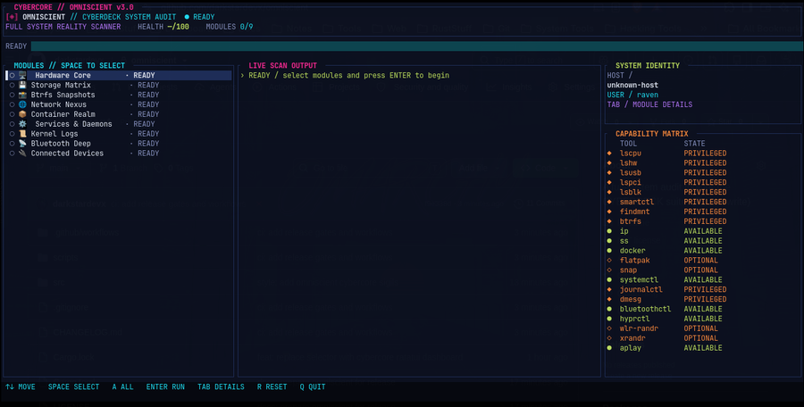
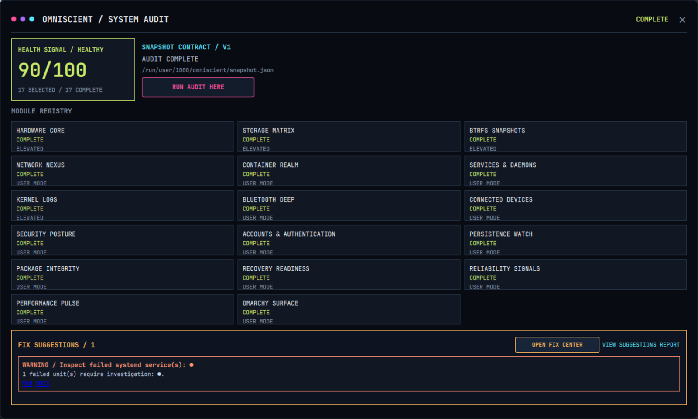
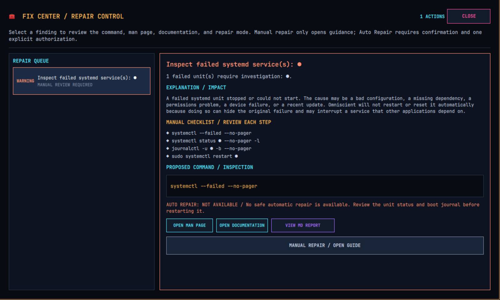
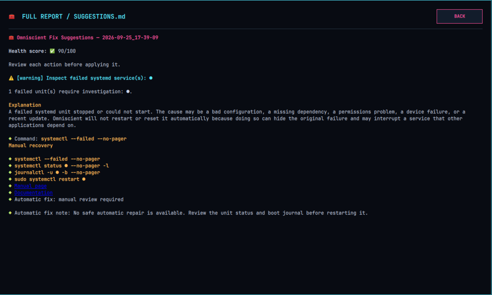
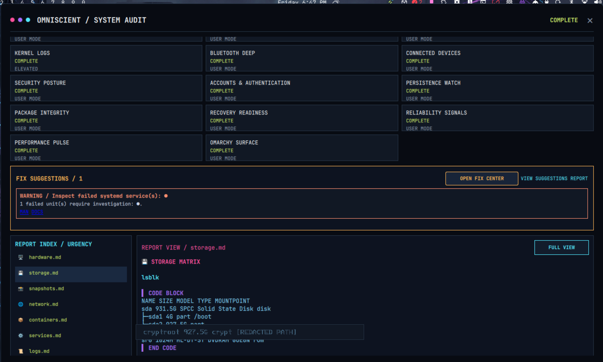
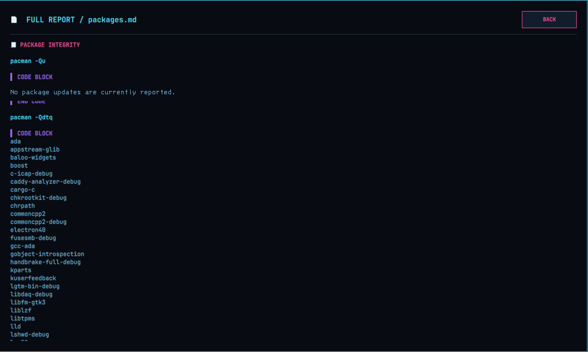

# ⟦◈⟧ OMNISCIENT // CYBERCORE SYSTEM AUDIT

[](https://github.com/cybercore-tech/omniscient/actions/workflows/ci.yml)

`omniscient` is the full-system audit console for the Cybercore family: a
Rust-powered, full-screen Ratatui dashboard that turns system inspection into
a readable, repeatable report.

**Live console:** [cybercore-tech.github.io/omniscient](https://cybercore-tech.github.io/omniscient/)

It began as a fish-shell cyberdeck with an ASCII HUD, a scanning animation,
and an `fzf` module picker. The Rust release keeps that spirit while adding a
structured 17-module registry across 10 conservative diagnostic domains, live
progress, health scoring, capability detection, privilege handling, and linked
Markdown reports.

> ⟦⟐⟧ **INITIAL RELEASE // v0.1.0** — The first public-ready Cybercore
> Omniscient release: tested, packaged, and automated through GitHub Actions.



*The first-run dashboard: module selection, live scan output, system identity,
and capability matrix in one view.*

## ⟦▥⟧ VISUAL WALKTHROUGH // THE OMNISCIENT SURFACE

These sanitized captures show the complete operator flow: launch a scan,
inspect device output, review repair guidance, and read the evidence in place.
Machine-specific usernames, hostnames, network addresses, hardware addresses,
and filesystem identifiers have been removed from the public previews.

<table>
  <tr>
    <td width="50%"></td>
    <td width="50%"></td>
  </tr>
  <tr>
    <td align="center"><sub>SYSTEM AUDIT / MODULE REGISTRY</sub></td>
    <td align="center"><sub>FIX CENTER / MANUAL OR AUTHORIZED REPAIR</sub></td>
  </tr>
  <tr>
    <td width="50%"></td>
    <td width="50%"></td>
  </tr>
  <tr>
    <td align="center"><sub>REPORT READER / FIX SUGGESTIONS</sub></td>
    <td align="center"><sub>REPORT READER / STORAGE MATRIX</sub></td>
  </tr>
  <tr>
    <td colspan="2" align="center"></td>
  </tr>
  <tr>
    <td colspan="2" align="center"><sub>REPORT READER / PACKAGE INTEGRITY</sub></td>
  </tr>
</table>

## ⟦◆⟧ INSTALLATION // BUILD + DEPLOY

### Requirements

- Linux with an interactive terminal
- Rust stable and Cargo
- `sudo` for privileged audit modules
- `systemd`, `lsblk`, and other audit tools are detected at runtime
- `pkexec` plus a graphical Polkit agent are optional

Clone and install:

```bash
git clone https://github.com/cybercore-tech/omniscient.git
cd omniscient
./install.sh
```

The installer:

- builds a locked release binary;
- uses `~/.cargo-target/` by default;
- installs to `~/.local/bin/omniscient`;
- replaces an active binary atomically, so a running instance does not cause
  a `Text file busy` failure;
- checks whether `~/.local/bin` is available on your `PATH`.

To choose another Cargo build directory:

```bash
CARGO_TARGET_DIR="$HOME/.cache/omniscient-target" ./install.sh
```

## ⟦◇⟧ USAGE // RUN A SCAN

Start the dashboard from a real terminal:

```bash
omniscient
```

The Omarchy HUD uses the non-interactive surface mode instead:

```bash
omniscient --hud
```

That mode runs the full audit while publishing progress and report paths to
the local snapshot contract. The Omarchy panel can launch it in place and
render completed Markdown reports without opening a second terminal.

The application is intentionally interactive. It requires a TTY so it can
enter the full-screen dashboard and restore your terminal cleanly when it
exits.

For a focused package pass, use the separate headless package command:

```bash
omniscient --packages
```

`--packages` selects only the Package Integrity module and publishes the same
snapshot/report contract used by the Omarchy HUD. It is deliberately separate
from `--hud` because package verification can be the slowest part of a scan on
large installations, especially when `pacman -Qkk` walks many installed
files. The command is read-only: it inventories package metadata and checks
local package files, but it does not install, remove, upgrade, or downgrade
anything.

### ⟦⌘⟧ Keyboard controls

| Key | Action |
| --- | --- |
| `↑` / `↓` or `j` / `k` | Move through audit modules |
| `Space` | Select or clear the highlighted module |
| `A` | Select all modules, or clear the current selection |
| `Enter` | Run the selected modules |
| `Tab` | Toggle capability matrix and module details |
| `R` | Reset the dashboard and selection |
| `Q` / `Esc` | Quit when an audit is not running |

Typical workflow:

1. Launch `omniscient`.
2. Select one or more modules with `Space`, or press `A` for a full audit.
3. Press `Enter`.
4. Authorize elevated modules if prompted.
5. Follow the live scan output and open the final `SUMMARY.md` path.

## ⟦⌬⟧ AUTH // PRIVILEGE MODES

The repository is distro-neutral. Terminal `sudo` is the default for every
user and every distribution:

```text
select privileged modules → dashboard pauses → sudo -v → dashboard resumes
```

Only the hardware, storage, Btrfs snapshot, and kernel-log modules request
elevated access. If authorization is canceled, the dashboard returns without
starting the audit.

Users with a graphical Polkit agent may opt in from their own shell:

```bash
export OMNISCIENT_AUTH=pkexec
omniscient
```

To force the portable terminal flow:

```bash
OMNISCIENT_AUTH=sudo omniscient
```

Any unsupported `OMNISCIENT_AUTH` value falls back to `sudo`. The project
does not impose an Omarchy or desktop-specific default on other users.

## ⟦▣⟧ MODULE GRID // WHAT GETS INSPECTED

- ⟦HW⟧ **Hardware Core** — CPU, hardware inventory, USB, and PCI data
- ⟦ST⟧ **Storage Matrix** — block devices and SMART health information
- ⟦BT⟧ **Btrfs Snapshots** — mounted Btrfs filesystems and subvolumes
- ⟦NW⟧ **Network Nexus** — interfaces and listening sockets
- ⟦CT⟧ **Container Realm** — Docker, Flatpak, and Snap inventory
- ⟦SV⟧ **Services & Daemons** — running and failed systemd services
- ⟦KL⟧ **Kernel Logs** — recent journal entries and kernel messages
- ⟦BD⟧ **Bluetooth Deep** — visible Bluetooth devices
- ⟦IO⟧ **Connected Devices** — displays and audio devices
- ⟦SP⟧ **Security Posture** — listeners, firewall state, kernel posture, and Secure Boot
- ⟦AA⟧ **Accounts & Auth** — local accounts, failed logins, sessions, and SSH configuration
- ⟦PW⟧ **Persistence Watch** — enabled units, timers, cron, and autostart entries
- ⟦PI⟧ **Package Integrity** — repository categories, versions, update status,
  updates, orphans, foreign packages, file verification, Flatpak/Snap
  inventory, and the Omarchy package surface
- ⟦RR⟧ **Recovery Readiness** — filesystem capacity, mounts, Btrfs scrub state, and trim
- ⟦RS⟧ **Reliability Signals** — kernel warnings, hardware errors, coredumps, and sensors
- ⟦PP⟧ **Performance Pulse** — load, memory, VM pressure, and boot latency
- ⟦OS⟧ **Omarchy Surface** — Omarchy, Hyprland, Quickshell, and shell diagnostics

The capability matrix marks tools as available, missing, optional, or
privileged before a scan starts. Missing optional tools are recorded as
skipped instead of being treated as a system failure.

### Package Integrity in detail

Package Integrity is an evidence pass, not a package manager. It combines
local `pacman` metadata with the configured sync database and records the
source category for each installed package. The report presents these
categories as a stable operator menu in the HUD:

| Category | Meaning |
| --- | --- |
| `ARCH OFFICIAL` | Installed packages matched to the official Arch sync metadata. |
| `OMARCHY` | Packages matched to the Omarchy repository. |
| `BLACKARCH` | Packages matched to the BlackArch repository when that repository is configured. |
| `CHAOTIC AUR` | Packages matched to Chaotic-AUR metadata when available. |
| `AUR / FOREIGN` | Unlisted, locally built, or otherwise foreign packages; this is an origin classification, not a claim that every entry came from the AUR. |

Each package line includes the installed version and a status token. `CURRENT`
means the local version is not listed by `pacman -Qu`; `UPDATE AVAILABLE`
means pacman reported that package as upgradeable. The report also keeps
explicitly installed packages, orphan candidates, file-integrity results,
Flatpak versions, Snap versions, and Omarchy package information in separate
sections so a long inventory remains auditable.

The Omarchy HUD adds a `PACKAGE SCAN` action beside `RUN FULL AUDIT`. A full
audit selects the 16 operational modules. Package Integrity is intentionally
excluded from that default pass. A package scan selects only Package Integrity,
marks the other modules idle, updates the live snapshot as the package pass
progresses, and writes a normal Markdown report plus `SUMMARY.md`. The report
viewer adds category buttons for `ALL`, `ARCH OFFICIAL`, `OMARCHY`,
`BLACKARCH`, `CHAOTIC AUR`, and `AUR / FOREIGN`; selecting one filters the
visible report without changing the saved evidence. Category headings, version
tokens, status labels, URLs, warnings, and code blocks receive semantic
Cybercore colors in the in-panel reader.

The package scan does not run as an implicit side effect of a normal HUD
audit. This keeps the default operator action predictable and lets users
choose the longer package verification pass when they actually want it.

## ⟦✦⟧ HEALTH // SIGNAL, NOT JUST INVENTORY

The health score starts at `100` and is adjusted using real signals:

- missing required tools;
- failed systemd units;
- disks reporting SMART health failure.

The score is a diagnostic signal, not a security certification or a warranty
that every system component is healthy.

## ⟦▤⟧ REPORTS // WHERE OUTPUT GOES

Reports are written beneath:

```text
~/.local/state/omniscient/
```

Omniscient honors `XDG_STATE_HOME` and stores reports in
`$XDG_STATE_HOME/omniscient` when that variable is set. You can choose a
different per-user location with `OMNISCIENT_REPORT_DIR`:

```bash
OMNISCIENT_REPORT_DIR="$HOME/.local/share/omniscient-reports" omniscient
```

Existing system-specific layouts are not changed or migrated automatically.

For a full scan:

```text
full_system_audit-YYYY-MM-DD_HH-MM-SS/
├── hardware-YYYY-MM-DD_HH-MM-SS/hardware.md
├── storage-YYYY-MM-DD_HH-MM-SS/storage.md
├── ...
└── SUMMARY.md
```

For a selected-module scan, reports are written directly beneath the same
Omniscient report root and the generated `SUMMARY.md` links to each result.
Command failures and unavailable tools remain visible in the Markdown output.

The HUD report surface is interactive. Module cards open their matching
report when one exists; the report index uses urgency colors, alternating
rows, hover feedback, and clickable entries; the compact reader can switch
to a full-window reader; and Markdown references are treated as explicit
read-only links. External documentation links require an in-panel allow
confirmation before the browser is launched.

### HUD state snapshot

While the dashboard is open, Omniscient publishes an atomic, read-only JSON
snapshot for local surfaces such as an Omarchy HUD:

```text
$XDG_RUNTIME_DIR/omniscient/snapshot.json
```

If `XDG_RUNTIME_DIR` is unavailable, the snapshot falls back to
`~/.local/state/omniscient/snapshot.json`. Set `OMNISCIENT_SNAPSHOT_PATH` to
override the location for an integration or test. The snapshot is versioned
with `schema_version: 1` and reports the audit state, health score, module
states, summary path, and any fatal error without exposing command output.

## ⟦⬡⟧ PROJECT MAP // DEVELOPMENT

```text
src/lib.rs         module declarations
src/main.rs        interactive entry point
src/tui.rs         interactive dashboard, input, worker thread, and progress state
src/headless.rs    full and focused in-panel runners, including --packages,
                   plus snapshot publishing
src/modules.rs     AuditModule trait and 17 audit modules across 10 domains
src/elevation.rs   sudo default and pkexec opt-in backend selection
src/health.rs      health scoring from system signals
src/paths.rs       XDG report-path resolution and per-user override
src/report.rs      SUMMARY.md generation
src/hud.rs         scanning animation helpers
omarchy-plugin/    Quickshell HUD client: full/package actions, live module
                   registry, category filtering, report reader, and fix center
src/pathcheck.rs   executable lookup without the which crate
scripts/gate.sh    local and CI quality gates
scripts/package.sh reproducible Linux release archive
assets/             release preview and project visuals
docs/               detailed operator contracts, including package integrity
install.sh         locked release build and atomic installation
LICENSE            MIT license
CHANGELOG.md       release history
```

Run the local quality gates before publishing a change:

```bash
./scripts/gate.sh quick    # format, compile, and tests
./scripts/gate.sh full     # all checks, including Clippy and shell syntax
./scripts/gate.sh release  # full checks plus an optimized build
```

The gates use `CARGO_TARGET_DIR` when provided; otherwise they keep build
artifacts in `.cargo-target/` inside the checkout.

## ⟦◌⟧ AUTOMATION // GITHUB WORKFLOWS

- `.github/workflows/ci.yml` runs the `release` gate on every pull request and
  push to `main`.
- `.github/workflows/release.yml` runs when a `v*` tag is pushed, packages the
  Linux binary, creates SHA-256 checksums, and publishes a GitHub Release.
- `scripts/package.sh` can reproduce the release archive locally.

To cut a release:

```bash
./scripts/gate.sh release
git tag -a v0.1.0 -m "release: v0.1.0"
git push origin main --follow-tags
```

The workflow publishes an archive containing the binary, README, and MIT
license. This is a GitHub/source release; the pinned Cybercore dependency is
Git-based and is not currently published as a crates.io dependency.

## ⟦⟐⟧ RELEASE STATUS

This is a Cybercore `0.1.x` release line: suitable for real local audits and
continued testing across Linux distributions. The tool reports what it can
observe and never silently treats unavailable commands as successful checks.

## ⟦©⟧ LICENSE

Released under the [MIT License](LICENSE).
